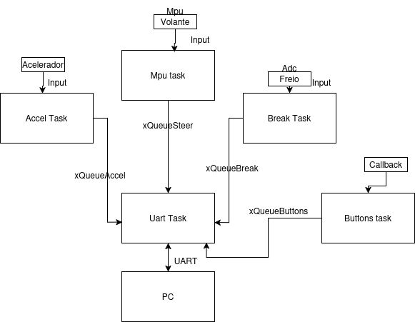
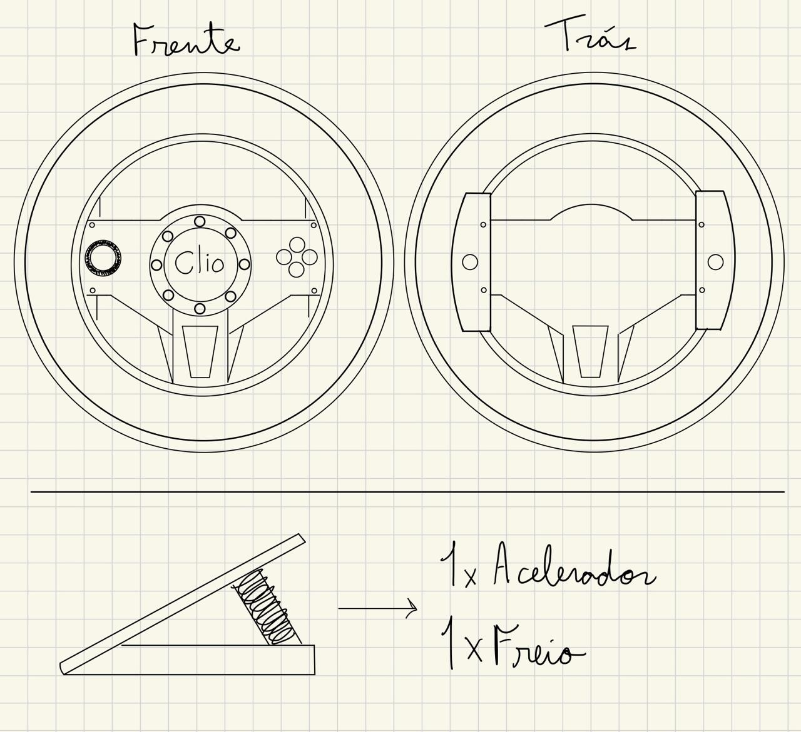
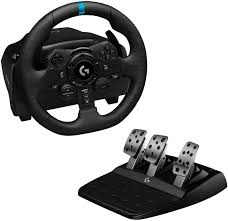

# Controle para Jogo - Forza

Este projeto visa criar um controle customizado para o jogo Forza, utilizando um volante e um pedal com freio e acelerador. O controle se comunica com o computador via protocolo UART, proporcionando uma experiência de simulação realista.
## Ideia do Controle

O controle será composto por um volante e dois pedais (freio e acelerador), permitindo que o jogador tenha uma imersão total durante o jogo. O volante será usado para controlar a direção do veículo, enquanto os pedais serão usados para controlar a velocidade e a frenagem.
## Inputs e Outputs
### Inputs:

    Volante: Detecção da rotação do volante (ângulo).

    Pedal Acelerador: Leitura da posição do pedal de acelerador.

    Pedal de Freio: Leitura da posição do pedal de freio.

### Outputs:

    Feedback de Força: Feedback tátil baseado em informações do jogo.

    LEDs: Indicadores visuais para status do controle (conectado/desconectado).

## Protocolo Utilizado

A comunicação entre o controle e o jogo será feita através do protocolo UART (Universal Asynchronous Receiver-Transmitter). O protocolo UART será utilizado para enviar dados dos sensores do volante e pedais para o computador. O envio será realizado em pacotes de dados que incluem informações sobre a rotação do volante e a posição dos pedais.

## Diagrama de Blocos Explicativo do Firmware

## Proposta do Controle:

## Controle Real:

