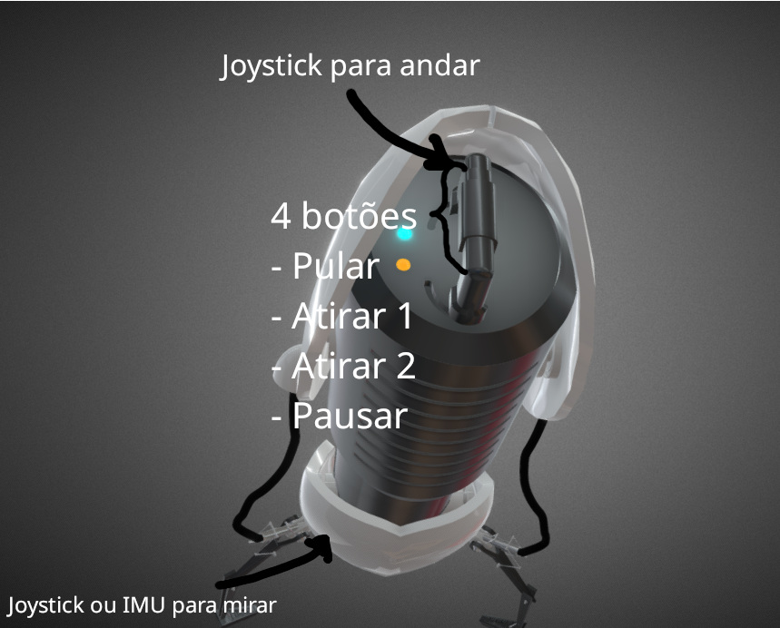
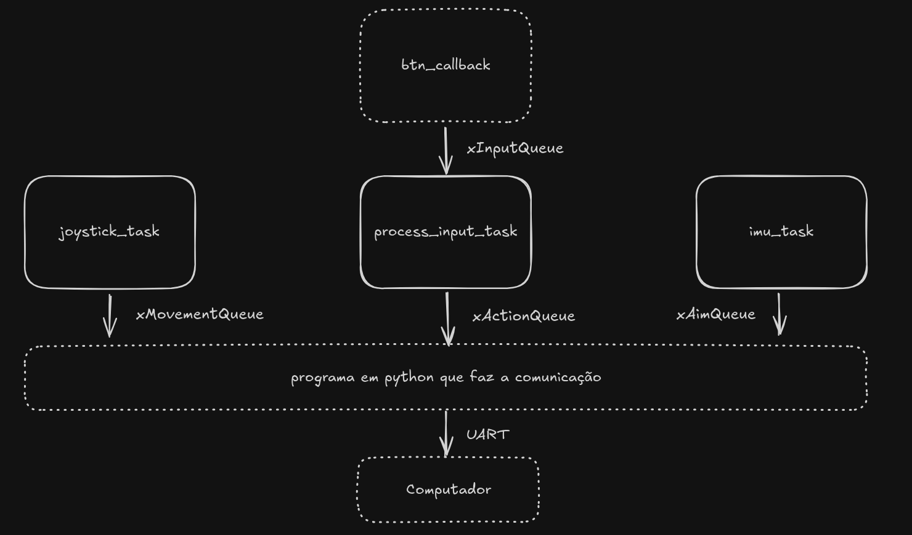

# Projeto ATLAS - Portal Gun para Portal 2

## 🎮 Jogo

**Portal 2** é um jogo de puzzle em primeira pessoa desenvolvido pela Valve. O jogador utiliza a Portal Gun para criar portais e resolver desafios baseados em física.

## 🔥 Ideia do Controle

O objetivo deste projeto é criar um protótipo funcional de um controle customizado inspirado na Portal Gun. O controle será utilizado para jogar Portal 2 e contará com botões físicos e sensores para uma experiência mais imersiva.

## 🖧 Inputs e Outputs

### **Inputs (Sensores e Controles)**

- **Botões físicos:**
  - Pular
  - Atirar 1
  - Atirar 2
  - Pausar
- **Analógicos:**
  - Controle de movimento do personagem (joystick)
  - Controle de mira (IMU ou joystick)

## 📡 Protocolo Utilizado

(Aqui será incluído o protocolo que será utilizado)

## 🛠️ Diagrama de Blocos

### **Estrutura do Firmware**

- **Tasks:**
  - Leitura do joystick (`joystick_task`)
  - Processamento dos botões (`process_input_task`)
  - Leitura da IMU (`imu_task`)
- **Filas:**
  - Eventos de entrada (botões e sensores)
    - `xInputQueue`
    - `xMovementQueue`
    - `xActionQueue`
    - `xAimQueue`
- **Interrupções (IRQs):**
  - Detecção de pressionamento de botões

## 🖼️ Imagens do Controle

(Aqui serão inseridas imagens do protótipo)

## 🔗 Links Úteis

- [Especificações da Raspberry Pi Pico](https://www.raspberrypi.com/documentation/microcontrollers/raspberry-pi-pico.html)
- [Documentação Bluetooth HID](https://www.bluetooth.com/specifications/profiles-overview/)
- [Portal gun pieces](https://www.thingiverse.com/thing:26027)

---
Este projeto é um protótipo experimental e está em desenvolvimento contínuo. Contribuições e sugestões são bem-vindas! 🚀

